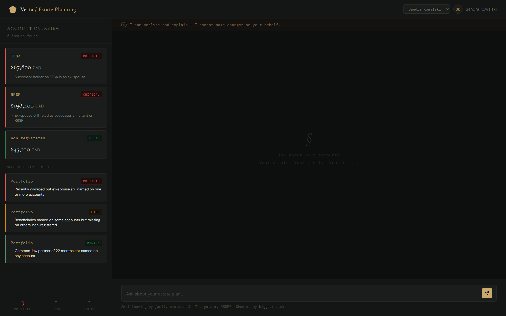
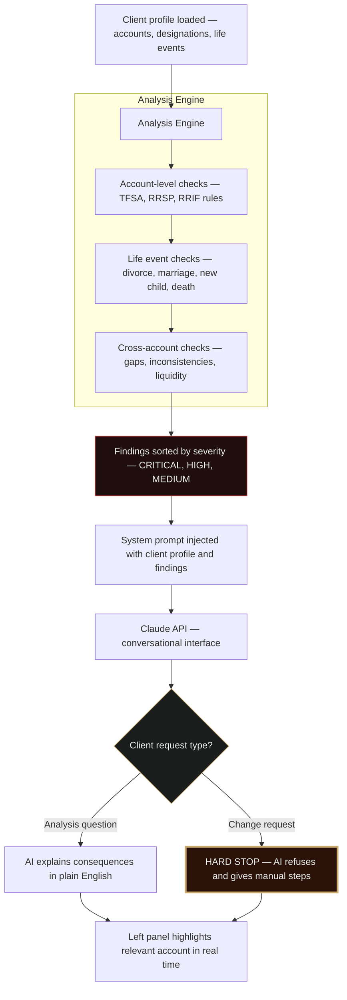

# Vesta: AI Estate Planning Assistant



**Vesta** is an AI-native estate planning assistant that analyzes Canadian registered accounts — TFSA, RRSP, RRIF — for beneficiary designation gaps, outdated designations, and life event triggers like divorce or death. Built as a submission for **Wealthsimple's AI Builder role**, Vesta demonstrates how AI can surface what clients don't know they don't know — before it becomes their family's problem.

The system runs a 30+ rule analysis engine against a client's account profile, identifies critical estate planning gaps, and explains the real legal and tax consequences in plain English through a conversational AI interface. A deliberate hard stop prevents the AI from executing any legal instructions — the decision always stays with the client.

## Features

- Automated analysis of TFSA, RRSP, RRIF, FHSA, and non-registered accounts
- Detects critical gaps — ex-spouse designations, deceased beneficiaries, missing designations, post-divorce risks
- Explains consequences in plain English with real dollar amounts
- Conversational AI chat powered by Claude API
- Hard stop boundary — AI analyzes and explains but never executes legal changes
- Real-time account risk visualization — left panel highlights accounts as AI discusses them
- 30+ rules covering Canadian estate law, tax consequences, and life event triggers
- Five realistic client profiles covering common Canadian estate planning failure scenarios

## The Hard Stop

The most important design decision in Vesta is what it refuses to do.

A beneficiary change on an RRSP is a legal instruction. If the AI executes it incorrectly — wrong person, wrong account, wrong timing — there is no recovery. The downside is catastrophic and the upside of AI convenience is small. So when a client asks Vesta to make a change, it stops completely, explains exactly why, and gives the client the specific steps to act themselves through the proper process.

```
Client: "Can you update my RRSP beneficiary to my new partner?"

Vesta:  "This is where I stop. A beneficiary change on a registered 
         account is a legal instruction that I am not permitted to execute. 
         If this were done incorrectly, the consequences could be 
         irreversible. Here is what you need to do yourself: ..."
```

## How It Works

Vesta processes client data through a sequential analysis and conversation pipeline:



## Client Profiles

Vesta ships with five realistic client profiles, each designed around a common Canadian estate planning failure scenario.

| Client | Scenario | Key Risk |
|---|---|---|
| Marcus Reid | Recently married, updated nothing | Ex-girlfriend still on RRSP |
| Sandra Kowalski | Recently divorced, updated nothing | Ex-spouse on $198K RRSP and TFSA |
| Aisha Okonkwo | New parent, designations predate child | No will, no guardian named |
| Gerald Whitmore | Elderly, everything outdated | Deceased designations on $312K RRIF |
| Tyler Park | Young, never set anything up | Zero designations across all accounts |

## Rules Engine

The analysis engine covers 30+ rules across six categories.

| Category | Rules | Examples |
|---|---|---|
| TFSA | T1 – T7 | No successor holder, ex-spouse designated, deceased beneficiary |
| RRSP / RRIF | R1 – R7 | No beneficiary, ex-spouse as successor annuitant, liquidity crisis |
| Life Events | L0 – L6 | Divorce, marriage, new child, outdated will, common-law partner |
| Cross-Account | C1 – C6 | Complete gap, inconsistent designations, will conflicts |
| Hard Stops | H1 – H5 | Change requests, legal advice, trust complexity |

## Project Structure

```
estate-planning-dashboard/
├── backend/
│   ├── analysis.py          
│   └── config/
│       ├── api.txt          # Anthropic API key (gitignored)
│       └── clients.json     # Client profiles
├── frontend/
│   ├── index.html
│   └── assets/
│       ├── css/styles.css
│       └── js/script.js
├── docs/
│   ├── rules.md             # Full rules documentation
│   ├── findings.json        # Generated analysis output
│   └── research.md
├── scripts/
│   └── proxy.js             # Local CORS proxy for Claude API
├── tests/
│   └── test.py              # Runs analysis and regenerates findings.json
├── .gitignore
├── requirements.txt
└── README.md
```

## Setup

**1. Clone the repo**
```bash
git clone https://github.com/your-username/estate-planning-dashboard
cd estate-planning-dashboard
```

**2. Install Python dependencies**
```bash
pip install -r requirements.txt
```

**3. Add your Anthropic API key**
```bash
echo "sk-ant-your-key-here" > backend/config/api.txt
```

**4. Run the analysis engine to generate findings**
```bash
python tests/test.py
```

**5. Start the proxy server**
```bash
node scripts/proxy.js
```

**6. Start the frontend server**
```bash
python -m http.server 8000
```

**7. Open the app**
```
http://localhost:8000/frontend/index.html
```
